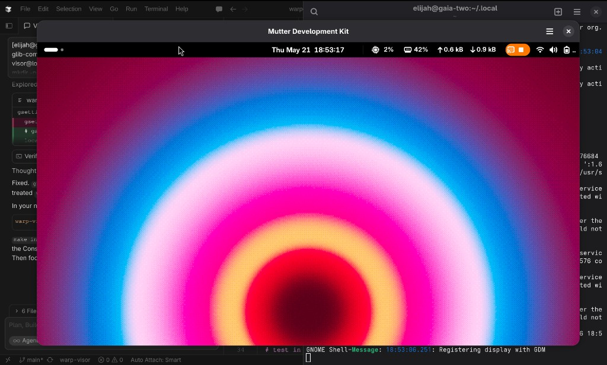

# Warp Visor

Warp Visor is a GNOME Shell extension that turns the Warp terminal into a
Wayland-friendly visor window.

It exists because terminal-global shortcuts are awkward on GNOME Wayland:
applications do not get to grab arbitrary global keyboard shortcuts when they
are unfocused. GNOME Shell can own those shortcuts, though, so this extension
registers Shell keybindings and uses Mutter window APIs to find, launch,
position, focus, and hide Warp.

## Features

- `<Shift><Alt>T` shows or toggles a top visor.
- `<Shift><Alt>B` shows or toggles a bottom visor.
- `<Shift><Alt>R` resets saved visor geometry to defaults.
- Pressing the active visor shortcut again minimizes Warp out of view.
- Default visor height is 50% of the monitor work area.
- Warp can be kept above other windows.
- Warp can be shown on all workspaces.
- Warp can be hidden from overview mode and Alt+Tab.
- Per-placement height is remembered when you manually resize the visor; width
  always spans the monitor work area.
- Maximized or full-work-area windows are not saved as visor geometry.

## Target Environment

This project is currently aimed at:

- GNOME Shell 50
- GNOME Wayland
- Warp desktop id: `dev.warp.Warp.desktop`

The default app id comes from Warp's desktop file:

```ini
Exec=warp-terminal %U
StartupWMClass=dev.warp.Warp
```

## Install

Install the extension into your local GNOME Shell extensions directory:

```sh
make install
```

Enable it:

```sh
gsettings set org.gnome.shell disable-user-extensions false
gnome-extensions enable warp-visor@local
gnome-extensions info warp-visor@local
```

`info` should report `Enabled: Yes` and `State: ACTIVE`. If shortcuts do nothing
after a Shell crash, GNOME may have set `disable-user-extensions` to `true` (see
Troubleshooting).

On GNOME Wayland, extension JavaScript loads inside the running Shell process.
After changing extension code on the **host**, log out and back in, or use the
nested development workflow below.

## Configure

This extension stores settings under:

```text
org.gnome.shell.extensions.warp-visor
```

Because the schema is extension-local, use `GSETTINGS_SCHEMA_DIR` when changing
settings from a terminal:

```sh
GSETTINGS_SCHEMA_DIR="$HOME/.local/share/gnome-shell/extensions/warp-visor@local/schemas" \
gsettings set org.gnome.shell.extensions.warp-visor default-height-percent 50
```

Useful settings:

```sh
GSETTINGS_SCHEMA_DIR="$HOME/.local/share/gnome-shell/extensions/warp-visor@local/schemas" \
gsettings set org.gnome.shell.extensions.warp-visor warp-app-id 'dev.warp.Warp.desktop'

GSETTINGS_SCHEMA_DIR="$HOME/.local/share/gnome-shell/extensions/warp-visor@local/schemas" \
gsettings set org.gnome.shell.extensions.warp-visor toggle-top-keybinding "['<Shift><Alt>T']"

GSETTINGS_SCHEMA_DIR="$HOME/.local/share/gnome-shell/extensions/warp-visor@local/schemas" \
gsettings set org.gnome.shell.extensions.warp-visor toggle-bottom-keybinding "['<Shift><Alt>B']"

GSETTINGS_SCHEMA_DIR="$HOME/.local/share/gnome-shell/extensions/warp-visor@local/schemas" \
gsettings set org.gnome.shell.extensions.warp-visor skip-taskbar true
```

Reset saved geometry:

- Press `<Shift><Alt>R` while the extension is enabled.
- Or open **Extensions → Warp Visor → Settings** and click **Reset** under Geometry.

Those paths clear saved geometry and immediately re-apply the default size to a
visible visor. Clearing geometry with `gsettings` alone also works, but the
running Shell only picks it up when the visor is shown or when the geometry
keys change.

```sh
GSETTINGS_SCHEMA_DIR="$HOME/.local/share/gnome-shell/extensions/warp-visor@local/schemas" \
gsettings set org.gnome.shell.extensions.warp-visor top-geometry ''

GSETTINGS_SCHEMA_DIR="$HOME/.local/share/gnome-shell/extensions/warp-visor@local/schemas" \
gsettings set org.gnome.shell.extensions.warp-visor bottom-geometry ''
```

## Develop

Run tests:

```sh
make test
```

Package the extension:

```sh
make package
```

Install local changes:

```sh
make install
```

### Quick dev loop (`warp-visor-dev`)

Install the helper once (adds `warp-visor-dev` to `~/.local/bin`):

```sh
make install-dev-cmd
```

Then:

```sh
warp-visor-dev host-prep    # host: disable extension, check devkit
warp-visor-dev enter        # host: opens isolated dbus-run-session
warp-visor-dev start        # inside enter: install, nested Shell, enable
# wait ~30-60s for a "Mutter Development Kit" window (nested GNOME desktop inside it)
# click inside that window, then Shift+Alt+T / B / R (GNOME Console target)
warp-visor-dev reload       # inside enter: after code changes
warp-visor-dev enable       # inside enter: if enable failed during start/reload
exit                         # leave nested session
warp-visor-dev host-restore # host: Warp app id + re-enable extension
```

Run `warp-visor-dev` with no arguments for full command list.

In Cursor, ask the agent to use **`/warp-visor-dev`** or the **warp-visor-dev** skill so it follows this flow. The skill is versioned in this repository at `.cursor/skills/warp-visor-dev/SKILL.md` (not a personal `~/.cursor/skills` copy). After nested and host behavior are confirmed working, that skill requires updating this README, the skill, committing, and pushing to the remote repo.

### GNOME Wayland development loop

GNOME Shell extensions run inside the GNOME Shell process. On Wayland the host
Shell cannot be restarted in place, so use a **nested development Shell** in an
isolated D-Bus session.

#### Two different “terminals”

| Role | What to use | Notes |
|------|-------------|--------|
| **Command terminal** | Any app (Warp, GNOME Terminal, etc.) | Only runs `dbus-run-session`, `make install`, `gnome-shell --devkit`, `gnome-extensions`. The app you type in does not matter. |
| **Visor target app** | **GNOME Console** in nested testing | Set `warp-app-id` to `org.gnome.Console.desktop` inside the nested session. Do not use Warp as the visor target in nested devkit—it is heavier and more likely to misbehave. |
| **Visor target app** | **Warp** on the host | Default `dev.warp.Warp.desktop` for daily use after you log out and verify on the real desktop. |

#### Safety rules

- Run `gnome-shell --devkit` and `gnome-extensions` **only** inside
  `dbus-run-session`, never in a normal host terminal. A second compositor on the
  host session can crash or log you out.
- On the **host**, run `gnome-extensions disable warp-visor@local` before nested
  testing so `<Shift><Alt>T/B/R` are not handled twice.
- After `make install` on the **host**, **log out and back in** before relying on
  Warp Visor there. Do not run `gnome-extensions enable` on the host right after
  `make install` without logging out (see Troubleshooting).
- On Arch, install `mutter-devkit`. Optional launcher: `/usr/lib/mutter-devkit`.

```sh
sudo pacman -S mutter-devkit
```

Set `GSETTINGS_SCHEMA_DIR` for nested `gsettings` commands:

```sh
export GSETTINGS_SCHEMA_DIR="$HOME/.local/share/gnome-shell/extensions/warp-visor@local/schemas"
```

#### 1. Prepare the host (normal session)

Run in any terminal on your **real desktop**:

```sh
gnome-extensions disable warp-visor@local
```

#### 2. Start nested session

```sh
dbus-run-session -- bash
```

Everything below runs **inside** that shell only.

#### 3. Install, point at GNOME Console, start nested Shell

```sh
cd /path/to/warp-visor
make install

gsettings set org.gnome.shell.extensions.warp-visor warp-app-id 'org.gnome.Console.desktop'

gnome-shell --devkit --wayland &
sleep 2
gnome-extensions enable warp-visor@local
gnome-extensions info warp-visor@local
```

`gnome-extensions info` must show `Enabled: Yes` and `State: ACTIVE`.

After `warp-visor-dev start`, a separate window titled **Mutter Development Kit**
usually appears within **30–60 seconds**. It contains a full nested GNOME desktop
(top bar, wallpaper, Activities)—not a terminal and not your host desktop. **Click
inside that window**, wait until the desktop looks ready, then press
`<Shift><Alt>T`, `<Shift><Alt>B`, and `<Shift><Alt+R>` there—not on the host
desktop.



Host `gnome-extensions` / `gsettings` in a normal terminal do **not** affect the
nested session. The nested session has its own D-Bus and settings.

#### 4. Iterate on code

From the same `dbus-run-session` shell:

```sh
make install
jobs          # find the nested gnome-shell job, often %1
kill %1
gnome-shell --devkit --wayland &
sleep 2
gnome-extensions enable warp-visor@local
```

Watch logs in the terminal that launched nested Shell:

```sh
journalctl --user -f -o cat
```

Geometry debug (after toggling in nested Shell): `/tmp/warp-visor-geometry.log`

#### 5. Tear down nested testing

In the `dbus-run-session` shell:

```sh
kill %1       # stop nested gnome-shell
exit          # leave isolated D-Bus session
```

#### 6. Restore the host for daily Warp use

Back in your **normal** session:

```sh
gsettings set org.gnome.shell disable-user-extensions false
gnome-extensions enable warp-visor@local
gnome-extensions info warp-visor@local

GSETTINGS_SCHEMA_DIR="$HOME/.local/share/gnome-shell/extensions/warp-visor@local/schemas" \
gsettings set org.gnome.shell.extensions.warp-visor warp-app-id 'dev.warp.Warp.desktop'
```

Log out and back in if you changed extension code or schemas on the host.

## Troubleshooting

### Host session logged out after nested-shell commands

If the whole desktop restarted, check the previous session log:

```sh
journalctl --user -b -1 --since '10 min ago' | rg 'warp-visor|gnome-shell.*dumped core|current-placement'
```

A common failure mode is reloading Warp Visor on the **host** right after
`make install` without logging out. The host Shell may still have an old settings
schema cached while the new `extension.js` expects newer keys; accessing a
missing key aborts GNOME Shell and ends the session.

Recovery:

1. Log back in.
2. Run `make install` again.
3. GNOME may have turned off **all** user extensions after the crash. Check and
   re-enable:

```sh
gsettings get org.gnome.shell disable-user-extensions
gsettings set org.gnome.shell disable-user-extensions false
gnome-extensions enable warp-visor@local
gnome-extensions info warp-visor@local
```

`gnome-extensions info` should show `Enabled: Yes` and `State: ACTIVE`. If it
shows `Enabled: No` while `disable-user-extensions` is still `true`, shortcuts
will do nothing.

4. Log out and back in once more if you changed extension code or schemas.

For nested testing, use only the `dbus-run-session` shell for devkit and
`gnome-extensions` commands. Re-enable the host copy when finished:

```sh
gsettings set org.gnome.shell disable-user-extensions false
gnome-extensions enable warp-visor@local
```

### Shortcuts do nothing after login

GNOME often disables all user extensions after a Shell crash:

```sh
gsettings get org.gnome.shell disable-user-extensions
gsettings set org.gnome.shell disable-user-extensions false
gnome-extensions enable warp-visor@local
```

### Shortcut fires on host during nested testing

Disable Warp Visor on the host before starting nested Shell:

```sh
gnome-extensions disable warp-visor@local
```

If a visor unexpectedly opens full height or keeps an old size, press
`<Shift><Alt>R` or use **Reset Saved Geometry** in the extension settings. If the
shortcut does nothing after an update, run `make install` and log out and back
in so GNOME Shell reloads the extension.

If GNOME reports an old JavaScript error after you changed the source, the host
Shell is probably still running cached extension code. Log out and back in, or
use the nested development Shell.

## References

- GNOME Shell extension debugging: https://gjs.guide/extensions/development/debugging.html#reloading-extensions
- Mutter window API: https://mutter.gnome.org/meta/class.Window.html
